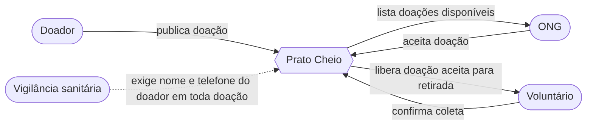
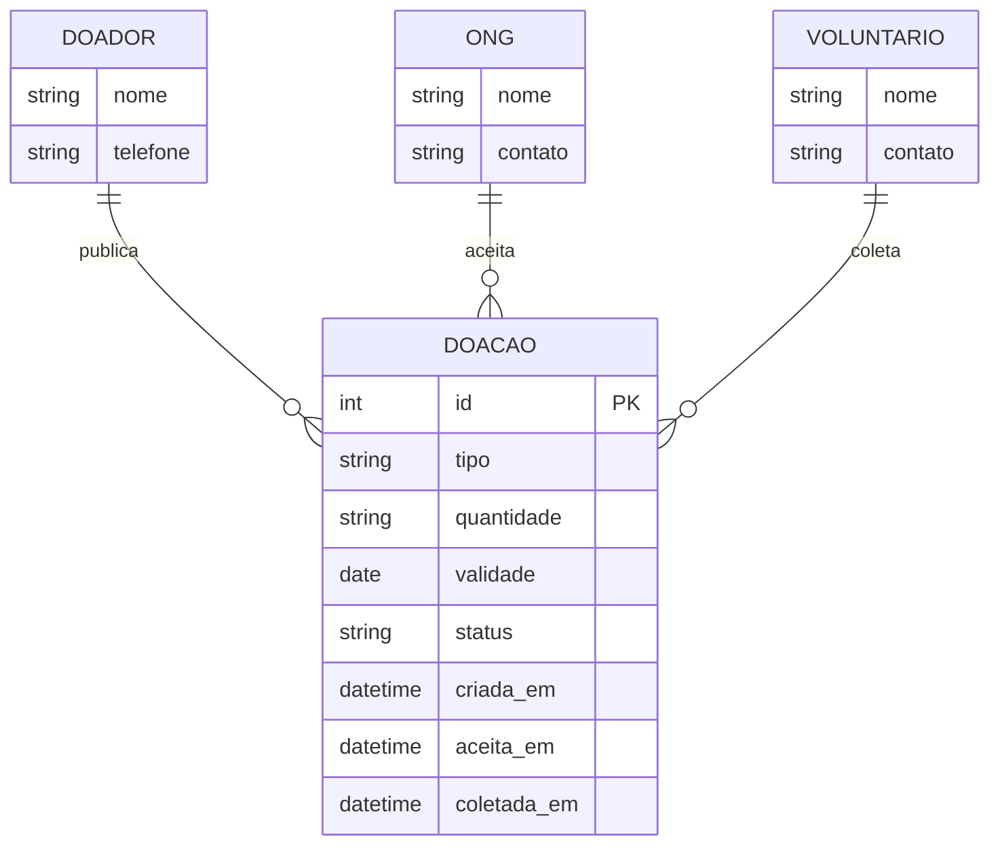

# Documento de Projeto — Prato Cheio

*Trabalho 2 · máximo 4 páginas (fora diagramas) · entrega na Aula 10*

## Decisões de projeto
| # | Decisão | Alternativas | Requisito/risco da Análise que a motiva |
|---|---|---|---|
| 1 | Como implementar a expiração automática da reserva (Regra 3 — devolver a doação para "disponível" se a ONG não confirmar a retirada em 120 min) | **A)** Job periódico que varre o banco e reverte doações vencidas · **B)** Verificação sob demanda, calculada no momento em que alguém lista as disponíveis | Regra 3 da Análise ("origem: ausente"), explicitamente fora da história zero até ser ratificada por Marta e pelas ONGs do piloto |
| 2 | Como definir operacionalmente "proximidade" entre doador e ONG para um futuro filtro de listagem | **A)** Proximidade por bairro/região cadastrado manualmente, sem cálculo de distância. **B)** Distância geográfica real (lat/long + fórmula de Haversine, exige geocodificar o endereço)· | Incerteza 4 da Análise — hoje o caso só registra o fato ("ONG perto leva vantagem"), não a regra de como isso é decidido |
| 3 | Como avisar as ONGs quando uma doação nova é publicada, sem estourar o orçamento do piloto | **A)** Polling no próprio front-end (a tela já chama `/api/doacoes`, só diminuir o intervalo) · **B)** E-mail via serviço gratuito (free tier de SMTP) disparado quando uma doação é criada | Notificação em tempo real foi explicitamente excluída da história zero na Análise por causa do orçamento "próximo de zero", motivada também pelo Objetivo de impacto 3 (diminuir o tempo entre publicação e aceite) |

## Tabela de trade-offs (uma decisão em detalhe)
Decisão 1 — expiração automática da reserva (Regra 3)
 
| Critério | A — Job periódico | B — Verificação sob demanda |
|---|---|---|
| Simplicidade de implementação | Baixa — precisa de um processo separado rodando junto do servidor (ou um scheduler externo) | Alta — é só uma condição a mais no SELECT que já lista as doações disponíveis |
| Consistência dos dados | Alta — o status no banco reflete a realidade a qualquer momento, mesmo sem ninguém consultar | Média — a doação só "volta" a aparecer disponível no instante em que alguém consulta a lista |
| Custo de infraestrutura | Maior — processo adicional rodando o tempo todo | Nenhum — reaproveita a mesma consulta que já existe em repositorio.js |
| Testabilidade | Mais difícil — o teste precisa simular passagem de tempo e o job rodando | Mais fácil — é só mais uma condição no teste que já existe para listarDisponiveis |

## Diagramas

### Diagrama de Contexto
 

### Modelo de Dados Principal
 

## ADRs
Ver `docs/adr/`.

## Requisitos não-funcionais
| Requisito | Como afeta o design |
|---|---|

## Critérios de validação do projeto

## Uso de IA
