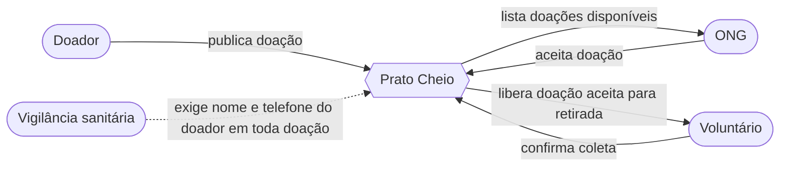
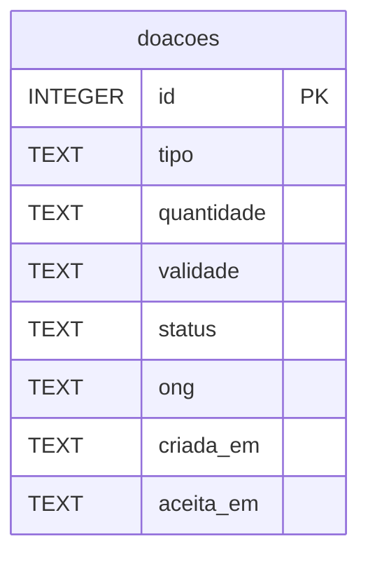

# Documento de Projeto — Prato Cheio

*Trabalho 2 · máximo 4 páginas (fora diagramas) · entrega na Aula 10*

## Decisões de projeto
| # | Decisão | Alternativas | Requisito/risco da Análise que a motiva |
|---|---|---|---|
| 1 | Como implementar a expiração automática da reserva (Regra 3 — devolver a doação para "disponível" se a ONG não confirmar a retirada em 120 min) | **A)** Job periódico que varre o banco e reverte doações vencidas · **B)** Verificação sob demanda, calculada no momento em que alguém lista as disponíveis | Regra 3 da Análise ("origem: ausente"), explicitamente fora da história zero até ser ratificada por Marta e pelas ONGs do piloto |
| 2 | Como definir operacionalmente "proximidade" entre doador e ONG para um futuro filtro de listagem | **A)** Proximidade por bairro/região cadastrado manualmente, sem cálculo de distância. **B)** Distância geográfica real (lat/long + fórmula de Haversine, exige geocodificar o endereço)· | Incerteza 4 da Análise — hoje o caso só registra o fato ("ONG perto leva vantagem"), não a regra de como isso é decidido |
| 3 | Como avisar as ONGs quando uma doação nova é publicada, sem estourar o orçamento do piloto | **A)** Polling no próprio front-end (a tela já chama `/api/doacoes`, só diminuir o intervalo) · **B)** E-mail via serviço gratuito (free tier de SMTP) disparado quando uma doação é criada | Notificação em tempo real foi explicitamente excluída da história zero na Análise por causa do orçamento "próximo de zero", motivada também pelo Objetivo de impacto 3 (diminuir o tempo entre publicação e aceite) |

## Tabela de trade-offs (uma decisão em detalhe)
Decisão 1 — expiração automática da reserva (Regra 3)
 
| Critério | A — Job periódico | B — Verificação sob demanda |
|---|---|---|
| Simplicidade de implementação | Baixa — precisa de um processo separado rodando junto do servidor (ou um scheduler externo) | Alta — é só uma condição a mais no SELECT que já lista as doações disponíveis |
| Consistência dos dados | Alta — o status no banco reflete a realidade a qualquer momento, mesmo sem ninguém consultar | Média — a doação só "volta" a aparecer disponível no instante em que alguém consulta a lista |
| Custo de infraestrutura | Maior — processo adicional rodando o tempo todo | Nenhum — reaproveita a mesma consulta que já existe em repositorio.js |
| Testabilidade | Mais difícil — o teste precisa simular passagem de tempo e o job rodando | Mais fácil — é só mais uma condição no teste que já existe para listarDisponiveis |

## Diagramas

### Diagrama de Contexto
 

```mermaid
flowchart LR
 
    Doador([Doador])
    Vigilancia([Vigilância sanitária])
    PratoCheio{{Prato Cheio}}
    ONG([ONG])
    Voluntario([Voluntário])
 
    Doador -->|publica doação| PratoCheio
    Vigilancia -.->|exige nome e telefone do doador em toda doação| PratoCheio
    PratoCheio -->|lista doações disponíveis| ONG
    ONG -->|aceita doação| PratoCheio
    PratoCheio -->|libera doação aceita para retirada| Voluntario
    Voluntario -->|confirma coleta| PratoCheio
```

### Modelo de Dados Principal
 

```mermaid
erDiagram
    doacoes {
        INTEGER id PK
        TEXT tipo
        TEXT quantidade
        TEXT validade
        TEXT status
        TEXT ong
        TEXT criada_em
        TEXT aceita_em
    }
```

Para esta etapa, escolhi avaliar o Modelo de Dados Principal (Diagrama ER) gerado pela IA. Ao comparar o resultado da IA com a análise feita pelo nosso grupo e com o arquivo db.js, identifiquei que o diagrama não é um retrato do nosso sistema, mas sim uma suposição idealizada do design.

Erros e inconsistências identificadas:

- **Invenção de tabelas e normalização inexistente:** A IA modelou DOADOR e ONG como entidades próprias e separadas. No entanto, o nosso banco de dados atual cria apenas uma única tabela chamada doacoes. Os dados da ONG são salvos apenas como uma coluna de texto (ong TEXT) direto na tabela de doações. Além disso, não existe nenhuma coluna no banco para salvar o nome ou telefone do doador. O modelo da IA sugeriu uma normalização que não reflete a estrutura atual do nosso código.

- **Inclusão do fluxo de "Coleta" que não foi implementado:** A IA incluiu a entidade VOLUNTARIO e o campo coletada_em na doação. Porém, a tabela doacoes configurada no nosso sistema registra apenas o momento de criação (criada_em) e de aceitação (aceita_em). Como decidimos deixar a confirmação de retirada de fora na Unidade 1, não existe controle de coleta de voluntários no banco de dados. O diagrama mostrou funcionalidades futuras que não estão presentes no sistema de hoje.

## ADRs
- [ADR 0001 — Migração do banco de dados de SQLite para PostgreSQL](./adr/0001-migracao-postgresql.md)

## Requisitos não-funcionais
| Requisito | Como afeta o design |
|---|---|
| Quando duas ONGs tentam aceitar a mesma doação na mesma janela de tempo, o sistema garante que só a primeira requisição processada marca a doação como aceita e a segunda recebe recusa explícita, medido por: 0 doações com duas ONGs associadas simultaneamente, verificável repetindo o teste "recusa aceitar uma doação que já foi aceita por outra ONG" (`tests/doacoes.test.js`) em chamadas concorrentes. | Motiva diretamente o ADR 0001, é o requisito que torna um único escritor (SQLite) insuficiente e justifica PostgreSQL. Custo: exige Docker (ou outro meio de hospedar Postgres) rodando em cada ambiente de desenvolvimento. |
| Quando a conexão do voluntário cai no meio da confirmação de retirada, restrição já registrada no caso ("roda no navegador do celular do voluntário, com internet ruim", citada em `docs/analise.md`, seção "Uso de IA", Linha 7), o sistema não deve duplicar nem perder a confirmação. Medido por: reenviar a mesma requisição de confirmação duas vezes resulta em um único registro de coleta, não dois, verificável simulando duplo clique/retry no endpoint quando ele existir. | Ainda não há decisão de projeto registrada para isso, a história 4 (confirmação de retirada) segue como pendência da Retrospectiva 1. Fica documentado aqui como requisito a atender quando essa história entrar em escopo; custo: nenhuma implementação ainda. |
| Quando um doador preenche o formulário de publicação, o sistema deve permitir concluir o cadastro em até 30 segundos, medido por: cronometragem manual do preenchimento até o clique em "Publicar", conforme o experimento já desenhado em `docs/analise.md` (seção "Hipótese e experimento"), com reprovação se a média ultrapassar 60s ou 2 de 3 doadores testados desistirem. | Motivou a Decisão de análise (`docs/analise.md`) de deixar autenticação de doador fora da história zero, qualquer campo extra no formulário compete com esse orçamento de tempo. Custo: abrir mão de autenticação no piloto. |
| Quando o banco for trocado de SQLite para PostgreSQL (ADR 0001), o comportamento observável da API não deve mudar, medido por: os mesmos testes de `tests/doacoes.test.js` passando sem alteração de asserts contra o Postgres do contêiner, e o job `build-e-testes` do CI ficando verde com o serviço `postgres:16-alpine` habilitado. | Decisão direta do ADR 0001, seção "Critério de validação". Custo: manter paridade de comportamento entre os dois bancos (ex.: `RETURNING`, tipos de dado) contida em `src/db.js`. |

## Critérios de validação do projeto

## Uso de IA
